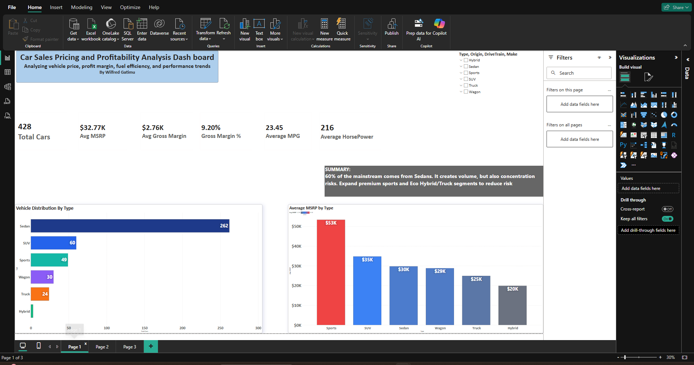

# Car Sales Pricing and Profitability Analysis

Interactive Power BI dashboard analyzing pricing, margin, and performance for 428 vehicles.

### Business Problem
60% of inventory is concentrated in Sedans creating revenue risk. This analysis identifies which segments to expand for margin growth and risk reduction.

### Key Insights
1. **Concentration Risk**: Sedans = 262/428 units (61%) but only 8.70% gross margin
2. **Margin Leaders**: Sports cars avg $53K MSRP vs $30K for Sedans, with 10.14% gross margin 
3. **HP vs Price Gap**: Trucks underpriced relative to horsepower. Opportunity to fix pricing.
4. **Efficiency Trade-off**: Hybrids deliver 56 MPG but lowest 8.09% margin and $20K MSRP

### Dashboard Preview

**Page 1: OverView Dashboard**

**Page 2: Margin & Efficiency

**Page 3: Price vs Horsepower**

### Recommendations
1. **Grow volume with Sedans** but protect margin by filling the $35K–$48K gap
2. **Expand premium Sports** segment - highest MSRP and strong 10.14% margin
3. **Fix Truck pricing** - high HP, low MSRP suggests underpricing

### Files
- `Car Sales and profitability analysis Project.pbix` - Power BI dashboard
- `data/cars.csv` - Source dataset, 428 rows

### Tools Used
SQL, Power BI, DAX, Data Visualization, Business Analysis
